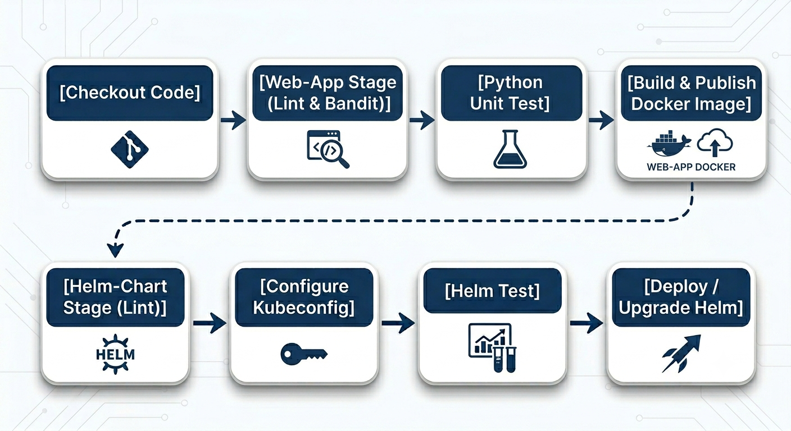

# Jenkins Notes

This section documents explanations and decision making related Jenkins component.
I'll describe Dockerfile, `docker-compose.yaml` file and Jenkinsfile pipeline.

To run Jenkins - follow the instructions on [running-jenkins.md](./running-jenkins.md).

## Dockerfile
Built upon 2 stages. At the build stage we download Docker, kubectl, Helm CLI binary and `yq` package.  
At the final stage we copy the binaries of the installations and configure Git username and email.
* Docker has 2 tools inside - Docker Daemon and Docker CLI. Since we don't use Docker Daemon (the reasons for that are explained in [running-jenkins.md](./running-jenkins.md)), we only move the binaries of Docker CLI to the final stage.
* `yq` allows parsing, filtering, and modifying YAML data. We will use it in our Docker pipeline.

## Docker Compose
Volume & bind mounts:
* `jenkins_home:/var/jenkins_home` (named volume)  
  Ensures stateful persistence for the Jenkins server. This volume preserves crucial application data - including installed plugins, credentials, pipeline definitions, and build job histories - across container restarts, updates, or removals.

* `~/.kube:/var/jenkins_home/.kube:ro` (bind mount)  
  Enables `kubectl` and Helm commands running within Jenkins pipelines to communicate with a Kubernetes cluster. For local development, this mounts the host machine's active Minikube configuration.
  * This is mounted as Read-Only (`:ro`) to prevent the containerized processes from accidentally altering the host's primary configuration. We will need to modify the config file in the pipeline, so first we will copy it and manipulate the copied file using `yq`.
  * In phase 4 we might be asked to deploy Jenkins to AWS. Since I won't have testing environment on AWS, as a quick and easy solution, I'm planning to install Minikube on the EC2 instance running Jenkins. So, it should act the same as running it locally.
* Minikube PKI Certificates (Bind Mounts):  
  The next three bind mounts (at `~/.minikube`) are the Public Key Infrastructure (PKI) certificates required by the `.kube/config` file to authenticate against the host's Minikube API server.  
  We use these certificates in Jenkins pipeline, at `kubectl config view --flatten --minify`.

`group_add` and `/var/run/docker.sock:/var/run/docker.sock` bind mount are explained in [running-jenkins.md](./running-jenkins.md).

## Jenkinsfile
* Overall flow  
  
* Checkout explicitly - while Jenkins pulls the repository implicitly, I preferred pulling it explicitly, so it won't look like magic.
* Triggers:
  * `web-app` - handles `web-app` Python application.  
    Triggered when there was a change in `./web-app/` folder  
    *OR* manually.
  * `helm-chart` - handles Helm Charts.  
    Triggered if the `web-app` stage was triggered and completed successfully  
    *OR* there was a change in `./helm-chart/` folder  
    *OR* manually.
  * I've included manual triggers in case a job fails and Jenkins does not detect a new changeset compared to the previous broken build.
    Also, I could make the job running automatically by using Poll SCM trigger, but I decided not to.
    I will consider adding a Webhook trigger if I will deploy Jenkins to AWS EC2 instance (maybe on phase 4).
* `web app` stage
  * Lint & bandit
    * Linting is the automated process of scanning our source code to catch bugs, syntax errors, and stylistic inconsistencies.  
    `Ruff` is an incredibly fast, all-in-one Python linter and formatter written in Rust.
    * `Bandit` is a specialized security linter for Python that scans our code to detect common vulnerabilities, insecure coding practices, and leaked secrets before deployment.
  * Python unit test
    * Testing by using Python's built-in `unittest` package.
    * `Coverage` is a tool that measures exactly how much of our source code is executed during testing.  
      The industry standard is to throw an error if less than 80%/90% is covered. Since the primary architectural focus of this project is infrastructure automation and CI/CD pipeline design, rather than application logic, the coverage benchmark was intentionally lowered to 75% to allow successful pipeline execution with a minimal test suite
  * Build & Publish Docker image to Docker Hub  
    I chose not to handle version management, so as a quick and easy workaround I used the execution date and build number. The date keeps the flows incrementing even if the container, with its volume (`jenkins_home`), is destroyed, while the build number helps us identify the build in case there is an issue and we want to get back to the logs.
  * Post script  
    `git reset --hard HEAD` - resets the changes. Necessary since we've installed testing packages using `uv`.  
    `git clean -fdx` - removed untracked files.  
    Both of these ensure that we are back to the latest commit state.
    Because we dynamically modify `pyproject.toml` at runtime using `uv add` to inject linting tools without bloating our base repository's production dependencies, a strict workspace reset is required post-execution to keep the agent clean.
* `helm-chart` stage
  * `helm lint` is a built-in tool within the standard Helm CLI that examines Kubernetes charts for structural mistakes, syntax errors, and deployment best practices.
  * Configure `kube` config file  
    For testing Helm Charts we need to install the updated Chart on a running K8s cluster. Since at phase 3 we still work locally, I decided to use the Minikube cluster running on the host machine.  
    * To communicate with it, I've passed `~/kube/config` file to the container by using bind mount (explained above, under [Docker Compose](#docker-compose) section).  
    * First, I've validated that `kube` config file `current-context` is Minikube cluster. This prevents working on other clusters, like on AWS, in case the host machine is connected to them.
    * We need to make some changes to the config file, so we first make a copy of it (an extra safeguard for making the volume read-only, as explained in [Docker Compose](#docker-compose) section).
    * In the config file we have a reference to certificates. For example, on Windows machine: `C:\Users\<user>\.minikube\profiles\minikube\client.crt`.
      Jenkins can't find these files in the host machine since it runs in a container.  
      Therefore, the next 2 `sed` commands replace certificates paths to refer to the mounted volume. For example, the Windows path above will turn into `~/.minikube/profiles/minikube/client.crt`.
    * `kubectl config view --flatten --minify`
      * `kubectl config view` prints `~/kube/config` content.
      * `--minify` shows only the `current-context`. So, irrelevant users or clusters are wiped out.
      * `--flatten` converts external file paths, like certificates, into embedded base64 strings so subsequent stages don't rely on host mounts.
    * Replacing `127.0.0.1` with `host.docker.internal`.  
      On `~/kube/config`, we can find the address of the cluster in `clusters[0].server`. For example: `https://127.0.0.1:63726`.  
      Minikube binds to a **randomized** high-port on the host machine upon startup.  
      We need to target that process running on the host machine. In Docker, we refer to the host machine by using `host.docker.internal` (like we use `localhost` in many cases).  
      So, the result of the `sed` change is `clusters[0].server: https://host.docker.internal:63726`.
    * Lastly, we remove `certificate-authority-data` and set `insecure-skip-tls-verify` to `true`
      * `certificate-authority-data` is a base64-encoded copy of our cluster’s root certificate (CA).
        It acts like a digital passport verification. When our client (like `kubectl` or `helm`) talks to the cluster, it uses this certificate data to verify that the server is authentic and not an attacker trying to intercept your traffic.
      * `insecure-skip-tls-verify: true` tells our client to completely bypass all SSL/TLS certificate validations.  
        It shuts off the security alarm. The client will happily connect to any server at that IP address, completely ignoring whether the certificate is expired, missing, or issued to a different domain name (which is exactly what allowed our traffic to pass through to `host.docker.internal`).
    Now, we have an updated minified `kube` config file to run our Helm tests.
  * Helm tests  
    To validate our Helm chart deployments before touching any production workloads, we spin up an isolated, short-lived environment:
    * Ephemeral Testing Namespace  
    We install the updated Helm chart into a dedicated testing namespace (`${TEST_NS}`). In a production-grade CI/CD architecture, this sandbox cluster typically mirrors core infrastructure components with **minimized** resource limits.
    * Automated Verification  
    We run `helm test`, which spins up a dedicated test runner pod inside that namespace to execute validation scripts against our freshly deployed application components. Once finished, it turns its status to `Completed`.
    * Bulletproof Teardown  
    Once testing concludes, the environment must be completely purged. This cleanup is wrapped in a Jenkins `post { always { ... } }` block to guarantee it executes even if the tests fail. The teardown uses two phases:
        * `helm uninstall` removes the chart release tracking history from the cluster.
        * `kubectl delete namespace` nukes the entire testing sandbox. In Kubernetes, deleting a namespace triggers a cascading deletion, meaning the cluster automatically sweeps through and destroys absolutely every resource tied to it—including application pods, configurations, secrets, and the lingering `Completed` test runner pods—all in a single background operation (`--wait=false`)
  * Deploy & Upgrade Helm
    * Helm Chart is published by using GitHub Pages, which is referenced to a dedicated branch ([helm-publish](https://github.com/Ori-Sason/devops-experts-final-project/tree/helm-publish)).
    * Since Jenkins updates the version, I considered committing the changes to the `main` branch as well. However, I've decided not to, since there is no version management system and I wanted to keep things simple.  
    For the same reason I'm publishing Docker images in a dedicated repository on Docker Hub, `orisason1/devops-experts-final-project-jenkins`, and not the main one, `orisason1/devops-experts-final-project`.
    * For downloading or installing the published package - check out dedicated instructions in [README.md](/README.md/#helm-chart).
  * Install on production - placeholder
    * In a production environment, we would execute `helm install` against the live cluster. For this local phase, that would mean redeploying the changes to the same host Minikube cluster. Since I've already manipulated Minikube cluster from Jenkins, for Helm testing, repeating that process felt redundant. So, I've decided just to keep a placeholder.
