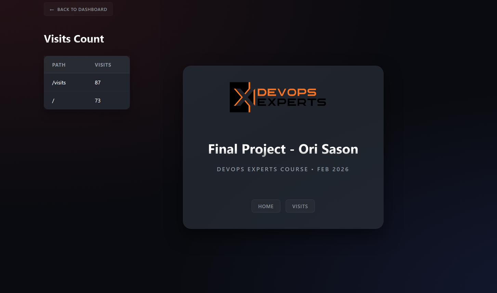
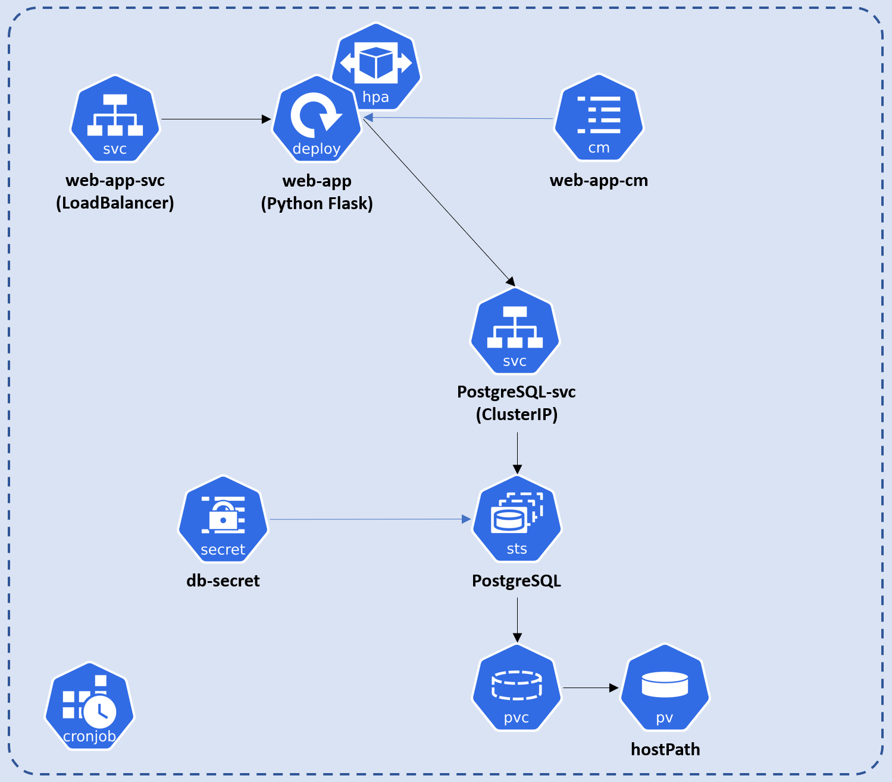

# DevOps Experts - Final Project
<u>Author</u>: Ori Sason  
This is the final project for the DevOps Experts program. We update it regularly during the course to include the new technologies and layers we study in each phase.

I've noted my technical decisions and learning process in [learning-notes](./MDs/learning-notes.md).

## Features
* Web app with 2 web pages: */* and */visits*.
* */visits* page shows a count of logging into the different pages of the app.
* For DB, I use PostgreSQL container, which stores on a Docker named volume.
* Dockerized: easily containerized for streamlined deployment.
* Kubernetes cluster deployed locally on Minikube.
* Support HPA - Horizontal Pod Autoscaling (check out [HPA.md](./MDs/HPA.md))
* Traffic cronjob - creates synthetic traffic to the application (check out [traffic-cronjob](./MDs/traffic-cronjob.md))

# Web App
<div align="center">
  
</div>

## Project structure
```
kubernetes              # Kubernetes definition files
MDs                     # Notes
web-app                 # Web app project
├───app.py              # Application entry point
├───docker-compose.yml
├───Dockerfile  
├───requirements.txt    # Python dependencies
├───db                  # DB related scripts
├───env
├───static
│   ├───css
│   └───images  
└───templates           # Jinja2 HTML templates (pages)
```
* Mentioned only relevant files

## Kubernetes architecture
<div align="center">
  
</div>

## Installation

### Requirements
1. Docker Desktop ([Installation](https://docs.docker.com/desktop/) - look for `Install Docker Desktop`).
2. Minikube (local Kubernetes for learning purposes) ([Installation](https://minikube.sigs.k8s.io/docs/start/?arch=%2Fwindows%2Fx86-64%2Fstable%2Fchocolatey)).

### Running the application locally using Docker Compose

```bash
cd web-app
docker compose up
```

Go to http://localhost/

Once finished, run the following to shut down the app
```bash
docker compose down
```

The DB will be stored for next runs.
Run `docker compose down -v` if you want to completely remove the application, including the DB.

* To keep things simple, I didn't ignore `postgres.env` and `web-app.env` files.
  On a real project, `.env` files shouldn't be uploaded to GitHub.

### Running the application on Kubernetes Minikube

Make sure Minikube is up an running by running `minikube status`.
If it's not, run `minikube start`.

To run the application
```bash
kubectl apply -f ./kubernetes/
```

Next, we need Minikube to expose the web service to our host machine
```bash
minikube service web-svc
```

This will open a tab on your browser showing the web app.

To shut down the application:
1. Stop the process of `minikube service web-svc`.
2. `kubectl delete -f ./kubernetes/`
