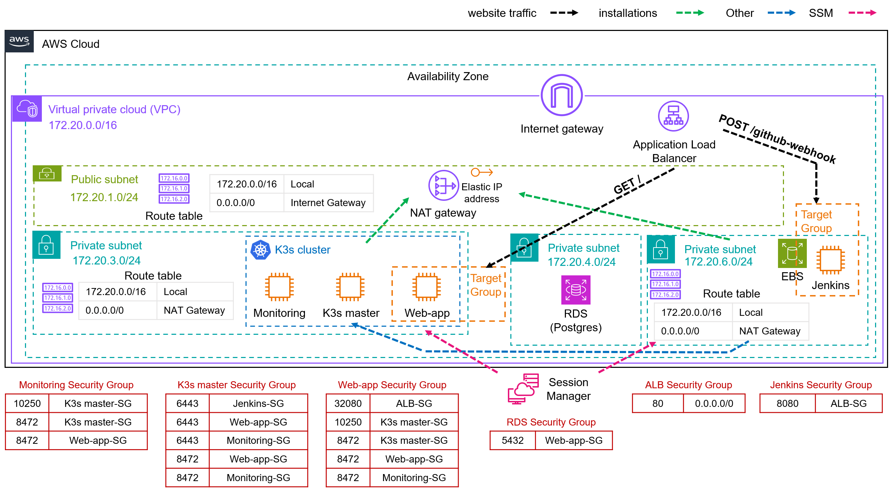

# DevOps Experts - Final Project
<u>Author</u>: Ori Sason  
This is the final project for the DevOps Experts program. I update it regularly during the course to include the new technologies and layers we study in each phase.

I've noted my technical decisions and learning process in [learning-notes.md](./MDs/learning-notes.md).  
A deep dive into Jenkins pipeline design and execution logic can be found in [jenkins-notes.md](./MDs/jenkins-notes.md).

## Features
* Python/Flask web app: a lightweight application featuring two primary endpoints (`/` and `/visits`).
* Traffic tracking: the `/visits` route dynamically displays access counts across the application.
* Persistent Database:
  * Locally - utilizes a containerized PostgreSQL database. Data is persisted via Docker named volumes (for local Compose deployments) and Kubernetes `hostPath` volumes (for Minikube deployments).
  * Remote - PostgreSQL database running on AWS RDS.
* Dockerized: easily containerized for streamlined deployment.
* Kubernetes orchestration: local cluster deployment managed via Minikube and Helm Charts or remote deployment on AWS via K3s.
* Kubernetes monitoring with Prometheus and Grafana.
* Scalability: supports Horizontal Pod Autoscaling (HPA) based on resource utilization (see [HPA.md](./MDs/HPA.md)). AWS deployment also supports node scalability by Auto Scaling Group (ASG).
* Load simulation: includes a Kubernetes CronJob designed to generate synthetic traffic to the application (see [traffic-cronjob.md](./MDs/traffic-cronjob.md)).
* Helm Chart is published on GitHub Pages.
* CI/CD automation: A fully declarative Jenkins pipeline automatically tests, builds, and publishes both the web application Docker image and the Helm Chart (hosted on GitHub Pages). Pipeline is triggered by GitHub Webhooks.
* Infrastructure as Code (IaC) by Terraform. Deploying on AWS.

## Web App
<div align="center">
  
</div>

## Project structure
```
helm-chart
├───monitoring          # Prometheus and Grafana
├───visit-count         # Web app application K8s code
jenkins
MDs                     # Architectural notes and documentation
terraform               # IaC deployment on AWS
web-app                 # Web app application source code
├───docker-compose.yml
├───Dockerfile  
├───pyproject.toml      # Python dependencies (uv)
├───env
├───src
│   ├───app.py          # Application entry point
│   ├───db              # DB related scripts
│   ├───static
│   │   ├───css
│   │   └───images  
│   └───templates       # Jinja2 HTML templates (pages)
└───tests               # Unit tests using Python's unittest module
```
* Mentioned only relevant files

## AWS architecture
<div align="center">
  
</div>

## Kubernetes architecture
<div align="center">
  
</div>

## Installation
* Remote installation on AWS - [aws-installation.md](/MDs/installations/aws-installation.md).  
* Local installation on Docker and Minikube - [local-installation.md](/MDs/installations/local-installation.md).

## Helm Chart
The application's Helm Chart is automatically packaged and published to GitHub Pages via the Jenkins pipeline (available on [`helm-publish`](https://github.com/Ori-Sason/devops-experts-final-project/tree/helm-publish) branch).

You can add this repository and deploy it to any cluster:
```bash
helm repo add myrepo https://ori-sason.github.io/devops-experts-final-project/
helm install <custom name> myrepo/visit-counter
```

To download and inspect the chart files locally without installing:
```bash
helm pull myrepo/visit-counter --untar
```
