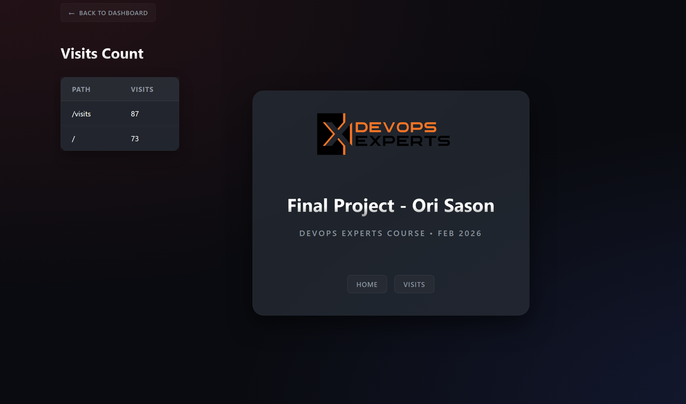
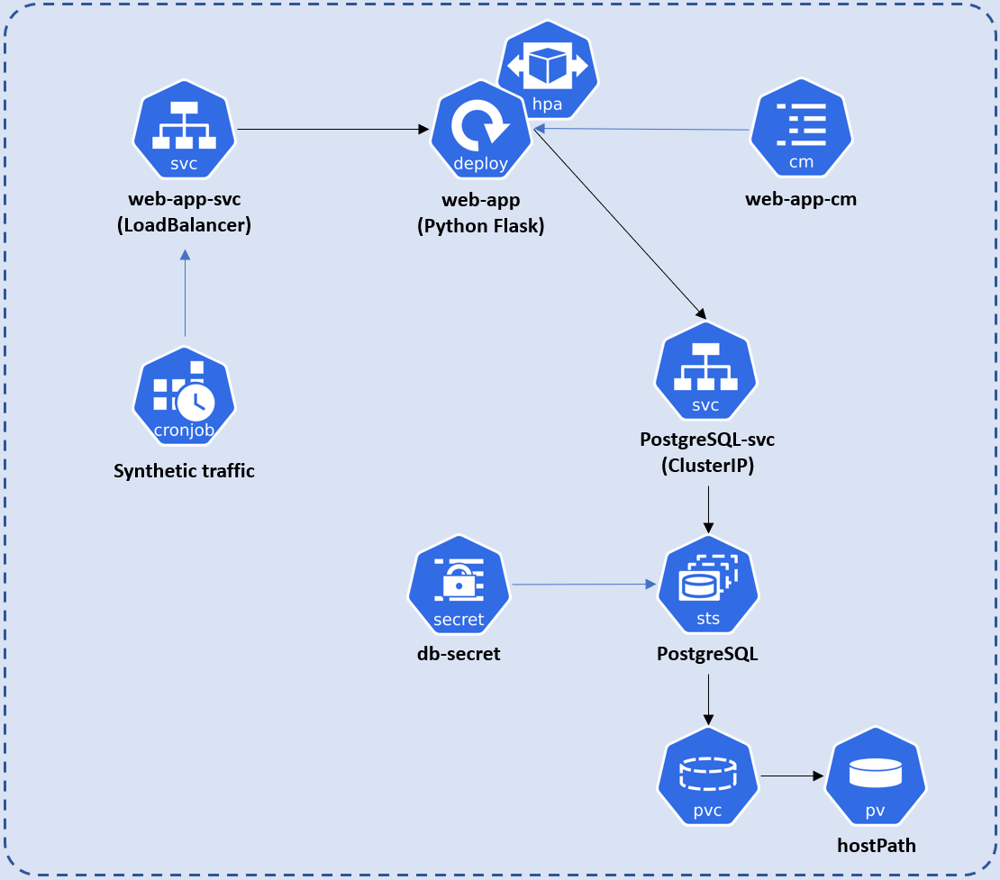

# DevOps Experts - Final Project
<u>Author</u>: Ori Sason  
This is the final project for the DevOps Experts program. I update it regularly during the course to include the new technologies and layers we study in each phase.

I've noted my technical decisions and learning process in [learning-notes.md](./MDs/learning-notes.md).

## Features
* Python/Flask web app: a lightweight application featuring two primary endpoints (`/` and `/visits`).
* Traffic tracking: the `/visits` route dynamically displays access counts across the application.
* Persistent Database: Utilizes a containerized PostgreSQL database. Data is persisted via Docker named volumes (for local Compose deployments) and Kubernetes `hostPath` volumes (for Minikube deployments).
* Dockerized: easily containerized for streamlined deployment.
* Kubernetes orchestration: local cluster deployment managed via Minikube and Helm Charts.
* Scalability: supports Horizontal Pod Autoscaling (HPA) based on resource utilization (see [HPA.md](./MDs/HPA.md)).
* Load simulation: includes a Kubernetes CronJob designed to generate synthetic traffic to the application (see [traffic-cronjob.md](./MDs/traffic-cronjob.md)).
* Helm Chart is published on GitHub Pages.
* CI/CD automation: A fully declarative Jenkins pipeline automatically tests, builds, and publishes both the web application Docker image and the Helm Chart (hosted on GitHub Pages).

## Web App
<div align="center">
  
</div>

## Project structure
```
helm-chart
jenkins
MDs                     # Architectural notes and documentation
web-app                 # Web app application source code
├───docker-compose.yml
├───Dockerfile  
├───pyproject.toml      # Python dependencies (uv)
├───env
├───src
│   ├───app.py          # Application entry point
│   ├───db              # DB related scripts
│   ├───static
│   │   ├───css
│   │   └───images  
│   └───templates       # Jinja2 HTML templates (pages)
└───tests               # Unit tests using Python's unittest module
```
* Mentioned only relevant files

## Kubernetes architecture
<div align="center">
  
</div>

## Installation

### Requirements
1. Docker Desktop ([Installation](https://docs.docker.com/desktop/) - look for `Install Docker Desktop`).
2. Minikube for local Kubernetes orchestration (mainly for learning purpose) ([Installation](https://minikube.sigs.k8s.io/docs/start/?arch=%2Fwindows%2Fx86-64%2Fstable%2Fchocolatey)).
3. Helm for kubernetes package management ([Installation](https://helm.sh/docs/intro/install/))

### Running the application locally using Docker Compose
To spin up the application and database locally
```bash
docker compose -f ./web-app/docker-compose.yml --project-directory . up
```

Access the application at http://localhost/.

To safely shut down the environment
```bash
docker compose -f ./web-app/docker-compose.yml --project-directory . down
```

**Note:** The PostgreSQL database state will be preserved in a named volume for future runs. To completely destroy the application and wipe the database volume, append the -v flag to the down command.

**Security Note:** To keep this local learning environment simple, .env files have not been added to .gitignore. In a production environment, hardcoded secrets are strictly prohibited and would be managed securely via Kubernetes ConfigMaps/Secrets or an external secret manager like AWS Secrets Manager or HashiCorp Vault.

### Running the application on Kubernetes Minikube

Ensure Minikube is active by running `minikube status`.
If it is stopped, initialize it buy running `minikube start`.

Deploy the application using the local Helm chart:
```bash
helm install app ./helm-chart/  # 'app' is a dynamic release name
```

To expose the web service from the Minikube cluster to your host machine:
```bash
minikube service visit-counter-dev-web-app-svc
```
This command will automatically open the application in your default web browser.

To shut down the application:
1. Terminate the active Minikube service process in your terminal (Ctrl+C).
2. Uninstall helm release by running `helm uninstall app`.

### Running Jenkins
To run Jenkins container, follow the instructions in [running-jenkins.md](./MDs/running-jenkins.md).  
A deep dive into the pipeline design and execution logic can be found in [jenkins-notes.md](./MDs/jenkins-notes.md).

## Helm Chart
The application's Helm Chart is automatically packaged and published to GitHub Pages via the Jenkins pipeline (available on [`helm-publish`](https://github.com/Ori-Sason/devops-experts-final-project/tree/helm-publish) branch).

You can add this repository and deploy it to any cluster:
```bash
helm repo add myrepo https://ori-sason.github.io/devops-experts-final-project/
helm install <custom name> myrepo/visit-counter
```

To download and inspect the chart files locally without installing:
```bash
helm pull myrepo/visit-counter --untar
```
